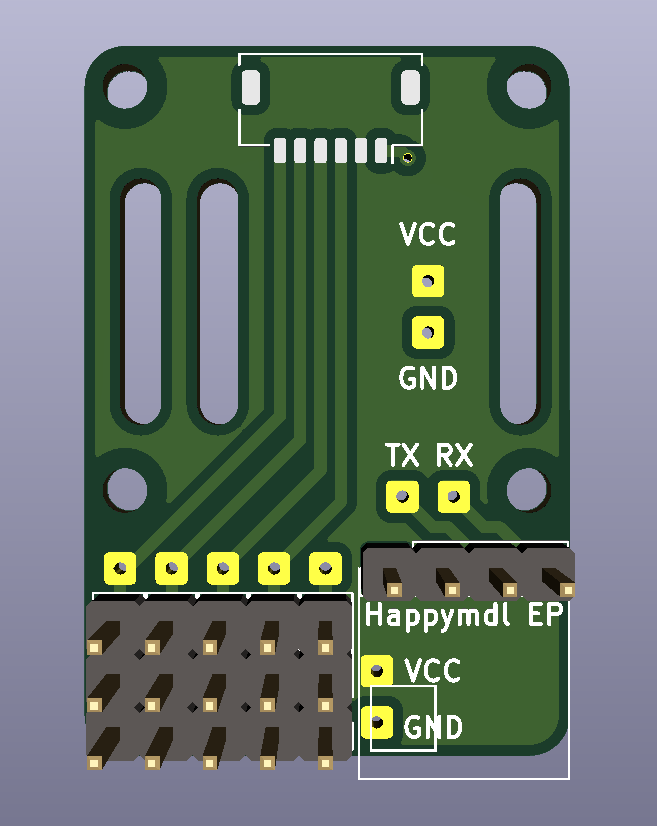

# 16mm FC, Dupont connectors, Happymodel EP RX

Suggested uses: 16mm flight controller in a heli or wing with regular Dupont servo connectors. Includes headers for a floating Happymodel EP1 or EP2.

